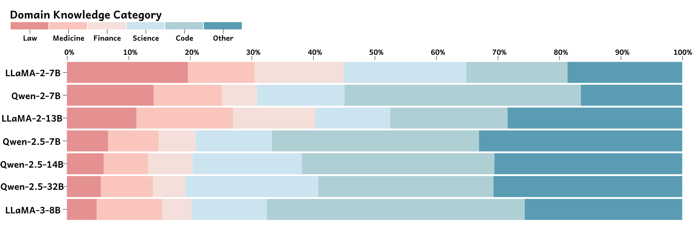
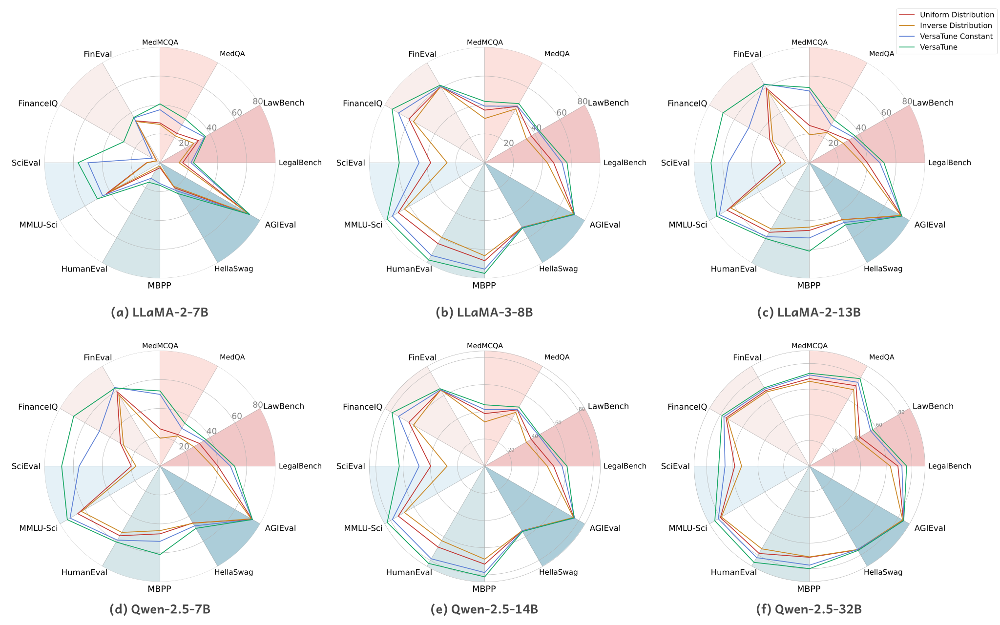
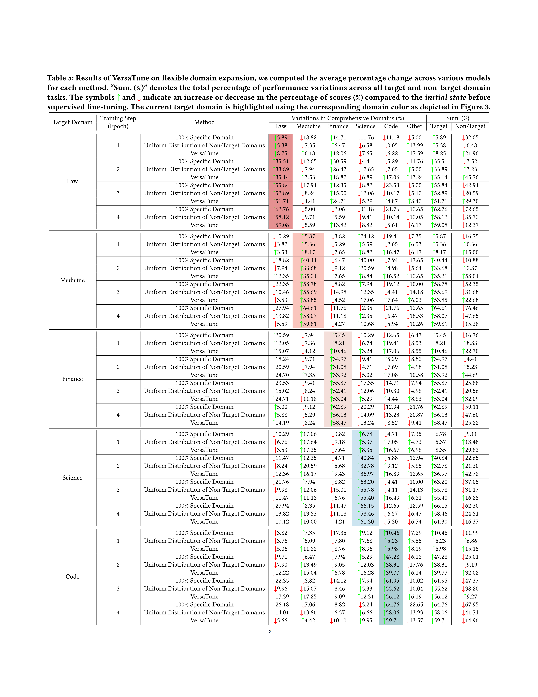

# VersaTune: An Efficient Data Composition Framework for Training Multi-Capability LLMs
<!-- [](https://opensource.org/licenses/MIT) -->

[](https://arxiv.org/abs/2409.00997)

Python implementation of ***VersaTune***, a novel data composition framework designed for enhancing models’ overall performances across different vertical domains during supervised fine-tuning (SFT).
We achieve improvements on open-source models including LLaMA ([LLaMA2-7B](https://huggingface.co/meta-llama/Llama-2-7b-hf), [LLaMA2-13B](https://huggingface.co/meta-llama/Llama-2-13b-hf), [LLaMA3-8B](https://huggingface.co/meta-llama/Meta-Llama-3-8B)) and Qwen ([Qwen2-7B](https://huggingface.co/Qwen/Qwen2-7B), [Qwen2.5-7B](https://huggingface.co/Qwen/Qwen2.5-7B), [Qwen2.5-14B](https://huggingface.co/Qwen/Qwen2.5-14B), [Qwen2.5-32B](https://huggingface.co/Qwen/Qwen2.5-32B)) series, where we categorize the domains into specific areas including *law*, *medicine*, *finance*, *science*, *code*, etc.
Experimental results demonstrate that VersaTune achieves significant improvements in multi-domain performance, with an 35.21% enhancement in comprehensive multi-domain tasks. Additionally, in scenarios where specific domain optimization is required, VersaTune reduces the degradation of performance in other domains by 38.77%, while preserving the target domain’s training efficacy.
The graphic below provides an overview of VersaTune. Check out the [paper](https://arxiv.org/pdf/2411.11266) for more details.


<!-- ## Getting started -->
## Installation
To get started, please clone the repo and install it:
```bash
git clone git@github.com:8023looker/VersaTune.git
pip install -r requirement.txt
```
<!-- conda create -n datasculpt python=3.10
conda activate datasculpt
pip install -r requirements.txt -->
<!-- conda install -c pytorch/label/nightly -c nvidia faiss-gpu=1.7.4 -->

<!-- ## Construct Pretraining Data using DataSculpt
We provide an example file in `./data_sample/input/` to demonstrate our pipeline, which is in jsonl format (`./data_sample/input/part-00000`) with each line representing one document.
```bash
cd src/
bash run_datasculpt_pipeline.sh 16000 0.5 0.5 5 # context_window delta epsilon iter_T
```

### Data Format
#### Input
```json
{
  "content": "This is an example of document content.",
  "docid": "falcon_talks.cam.acuk_0b1809",
  "...": "..."
}
```
#### Output
```json
{
  "total_token_num": 2,
  "docs": [{
      "content": "This is an example of document content.",
      "docid": "falcon_talks.cam.acuk_0b1809",
      "vector_encoded": [0.142877, "...", "..."],
      "...": "..."
    },{
      "content": "This is an example of document content.",
      "docid": "falcon_talks.cam.acuk_0b1809",
      "vector_encoded": [0.142877, "...", "..."],
      "...": "..."
    }
  ]
}
```
<!-- #### [Optional] Running DataSculpt on your own dataset -->
<!-- [Optional] To run DataSculpt on your own dataset, provide data as the [input](#input) format, refering to `./data_sample/input/part-00000`. -->


## Experimental Results 

### Phase1: Domain Knowledge Detection


### Phase2: Efficient Multi-Capability Fine-Tuning

#### Multi-Ability Fostering


#### Flexible Domain Expansion

<!--  -->


## Citation 

If this was useful to you, please cite the [paper](https://arxiv.org/abs/2411.11266):
```
@misc{lu2024versatuneharnessingverticaldomain,
      title={VersaTune: An Efficient Data Composition Framework for Training Multi-Capability LLMs}, 
      author={Keer Lu and Keshi Zhao and Zheng Liang and Da Pan and Shusen Zhang and Xin Wu and Weipeng Chen and Zenan Zhou and Guosheng Dong and Bin Cui and Wentao Zhang},
      year={2024},
      eprint={2411.11266},
      archivePrefix={arXiv},
      primaryClass={cs.CL},
      url={https://arxiv.org/abs/2411.11266}, 
}
```
